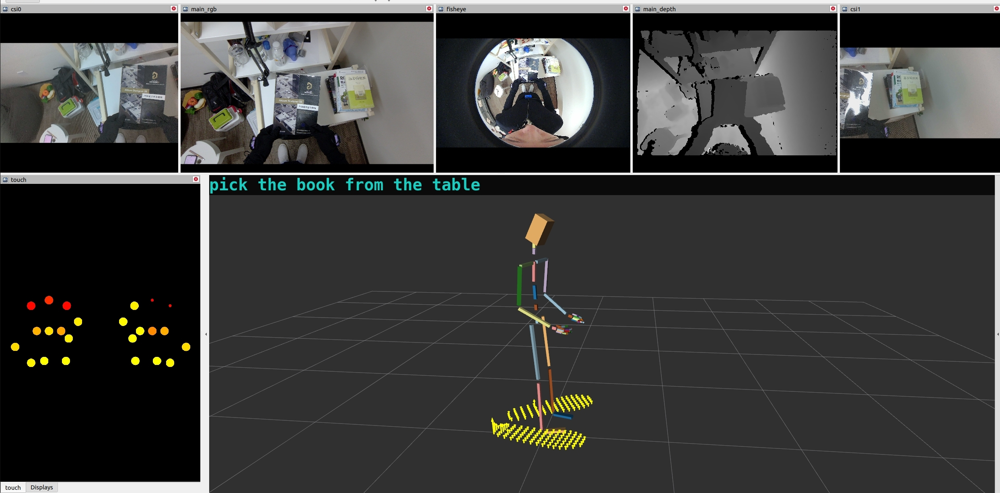

# IO—DATA-VISUALIZATION

## Install Dependencies

Please refer to the dependencies in Dockerfile.

Otherwise, env with ros1 and opencv should work.

## Build

```bash
mkdir io_data_visualization
cd io_data_visualization
git clone https://github.com/ioai-tech/IO-DATA-VISUALIZATION.git src/
catkin build
```

## Run

```bash
cd io_data_visualization
source ./devel/setup.bash
roslaunch io_data_visualizer io_data_visualizer.launch  
```

In another terminal,run:

```bash
cd io_data_visualization
python src/rawdata_to_ros1/rawdata_to_ros1.py {trajectory folder path} # press ctrl c in terminal if you want exit it
```


A rviz window should be displayed as following:

